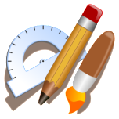

<div id="top"></div>

<!-- PROJECT SHIELDS -->
<!--
*** I'm using markdown "reference style" links for readability.
*** Reference links are enclosed in brackets [ ] instead of parentheses ( ).
*** See the bottom of this document for the declaration of the reference variables
*** for contributors-url, forks-url, etc. This is an optional, concise syntax you may use.
*** https://www.markdownguide.org/basic-syntax/#reference-style-links
-->
[![Contributors][contributors-shield]][contributors-url]
[![Forks][forks-shield]][forks-url]
[![Stargazers][stars-shield]][stars-url]
[![Issues][issues-shield]][issues-url]
[![MIT License][license-shield]][license-url]
[![LinkedIn][linkedin-shield]][linkedin-url]


<!-- PROJECT LOGO -->
<br />
<div align="center">
  <a href="https://github.com/Tija01/draw_webapp">
    
  </a>

  <h3 align="center">draw webapp</h3>

  <p align="center">
    A web application for your little drawings!
    <br />
    <a href="https://github.com/Tija01/draw_webapp"><strong>Explore the docs »</strong></a>
    <br />
    <br />
    <a href="https://draw-webapp.herokuapp.com/">View Demo</a>
    ·
    <a href="https://github.com/Tija01/draw_webapp/issues">Report Bug</a>
    ·
    <a href="https://github.com/Tija01/draw_webapp/issues">Request Feature</a>
  </p>
</div>


<!-- TABLE OF CONTENTS -->
<details>
  <summary>Table of Contents</summary>
  <ol>
    <li>
      <a href="#about-the-project">About The Project</a>
      <ul>
        <li><a href="#built-with">Built With</a></li>
      </ul>
    </li>
    <li>
      <a href="#getting-started">Getting Started</a>
      <ul>
        <li><a href="#prerequisites">Prerequisites</a></li>
        <li><a href="#installation">Installation</a></li>
      </ul>
    </li>
    <li><a href="#usage">Usage</a></li>
    <li><a href="#roadmap">Roadmap</a></li>
    <li><a href="#contributing">Contributing</a></li>
    <li><a href="#license">License</a></li>
    <li><a href="#contact">Contact</a></li>
    <li><a href="#acknowledgments">Acknowledgments</a></li>
  </ol>
</details>


<!-- ABOUT THE PROJECT -->
## About The Project

[![Product Name Screen Shot][product-screenshot]](https://draw-webapp.herokuapp.com/)

Draw webapp allows you to make simple drawings directly on your favorite web browser. It is the tool that you need for making simple 2D art on the fly.

Here's why:
* No need to install an external application on your desktop or your phone
* Free and add-free
* Open-source
* Access to a public library of all drawings made on the app
* All your drawings are kept at your disposition on the cloud server 

Need a new feature? Feel free to implementing by forking the repo then creating a pull request or open an issue.

Go try the app at [https://draw-webapp.herokuapp.com/](https://draw-webapp.herokuapp.com/) to get started.

<p align="right">(<a href="#top">back to top</a>)</p>


### Built With

This section should list any major frameworks/libraries used to bootstrap the project.

* [Flask](https://flask.palletsprojects.com/en/2.1.x/)
* [Bootstrap](https://getbootstrap.com)
* [SQLalchemy](https://www.sqlalchemy.org/)
* [Jinja](https://jinja.palletsprojects.com/en/3.1.x/)


<p align="right">(<a href="#top">back to top</a>)</p>


<!-- GETTING STARTED -->
## Getting Started

The app is ready to use on the dedicated [heroku server](https://draw-webapp.herokuapp.com/)
To get a copy running on your local server follow these simple example steps.

### Prerequisites

The required library packages are listed in the requirements.txt file.

This is an example of how to list things you need to use the software and how to install them.
* npm
  ```sh
  npm install npm@latest -g
  ```

### Installation

_Below is an example of how you can install and set up your app to run on a local server._

1. Clone the repo
   ```sh
   git clone https://github.com/Tija01/draw_webapp.git
   ```
2. Install NPM packages
   ```sh
   npm install
   ```

<p align="right">(<a href="#top">back to top</a>)</p>


<!-- USAGE EXAMPLES -->
## Usage

Demo video url: TODO

<p align="right">(<a href="#top">back to top</a>)</p>


<!-- ROADMAP -->
## Roadmap

- [x] Add basic drawing features
- [X] Create a library database containing links to drawing images  
- [ ] Add more drawing functionalities
- [ ] Create a more user-friendly interface
- [ ] Multi-language Support
    - [X] English
    - [ ] Français
    - [ ] Arabic

See the [open issues](https://github.com/Tija01/draw_webapp/issues) for a full list of proposed features (and known issues).

<p align="right">(<a href="#top">back to top</a>)</p>


<!-- CONTRIBUTING -->
## Contributing

Contributions are what make the open source community such an amazing place to learn, inspire, and create. Any contributions you make are **greatly appreciated**.

If you have a suggestion that would make this better, please fork the repo and create a pull request. You can also simply open an issue with the tag "enhancement".
Don't forget to give the project a star! Thanks again!

1. Fork the Project
2. Create your Feature Branch (`git checkout -b feature/AmazingFeature`)
3. Commit your Changes (`git commit -m 'Add some AmazingFeature'`)
4. Push to the Branch (`git push origin feature/AmazingFeature`)
5. Open a Pull Request

<p align="right">(<a href="#top">back to top</a>)</p>


<!-- LICENSE -->
## License

Distributed under the MIT License. See `LICENSE` for more information.

<p align="right">(<a href="#top">back to top</a>)</p>


<!-- CONTACT -->
## Contact

Hamza Tijani - hamza.tijani1@gmail.com

Project Link: [https://github.com/Tija01/draw_webapp](https://github.com/Tija01/draw_webapp)

<p align="right">(<a href="#top">back to top</a>)</p>


<!-- ACKNOWLEDGMENTS -->
## Acknowledgments

* [CS50X](https://cs50.harvard.edu/x/)
* [heroku](https://heroku.com/)
* [Best-README-Template](https://github.com/othneildrew/Best-README-Template)
* [Img Shields](https://shields.io)

<p align="right">(<a href="#top">back to top</a>)</p>


<!-- MARKDOWN LINKS & IMAGES -->
<!-- https://www.markdownguide.org/basic-syntax/#reference-style-links -->
[contributors-shield]: https://img.shields.io/github/contributors/Tija01/draw_webapp.svg?style=for-the-badge
[contributors-url]: https://github.com/Tija01/draw_webapp/graphs/contributors
[forks-shield]: https://img.shields.io/github/forks/Tija01/draw_webapp.svg?style=for-the-badge
[forks-url]: https://github.com/Tija01/draw_webapp/network/members
[stars-shield]: https://img.shields.io/github/stars/Tija01/draw_webapp.svg?style=for-the-badge
[stars-url]: https://github.com/Tija01/draw_webapp/stargazers
[issues-shield]: https://img.shields.io/github/issues/Tija01/draw_webapp.svg?style=for-the-badge
[issues-url]: https://github.com/Tija01/draw_webapp/issues
[license-shield]: https://img.shields.io/github/license/Tija01/draw_webapp.svg?style=for-the-badge
[license-url]: https://github.com/Tija01/draw_webapp/blob/main/LICENSE
[linkedin-shield]: https://img.shields.io/badge/-LinkedIn-black.svg?style=for-the-badge&logo=linkedin&colorB=555
[linkedin-url]: https://www.linkedin.com/in/hamza-tijani-558671195/
[product-screenshot]: images/name.PNG
